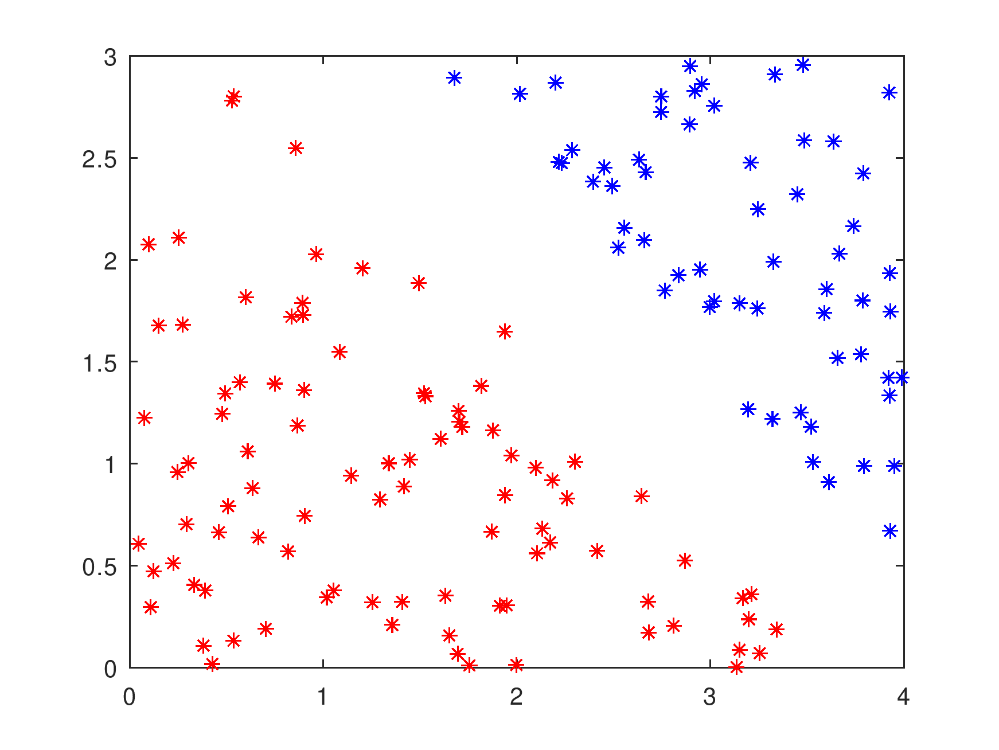
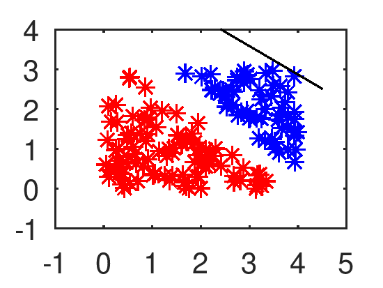
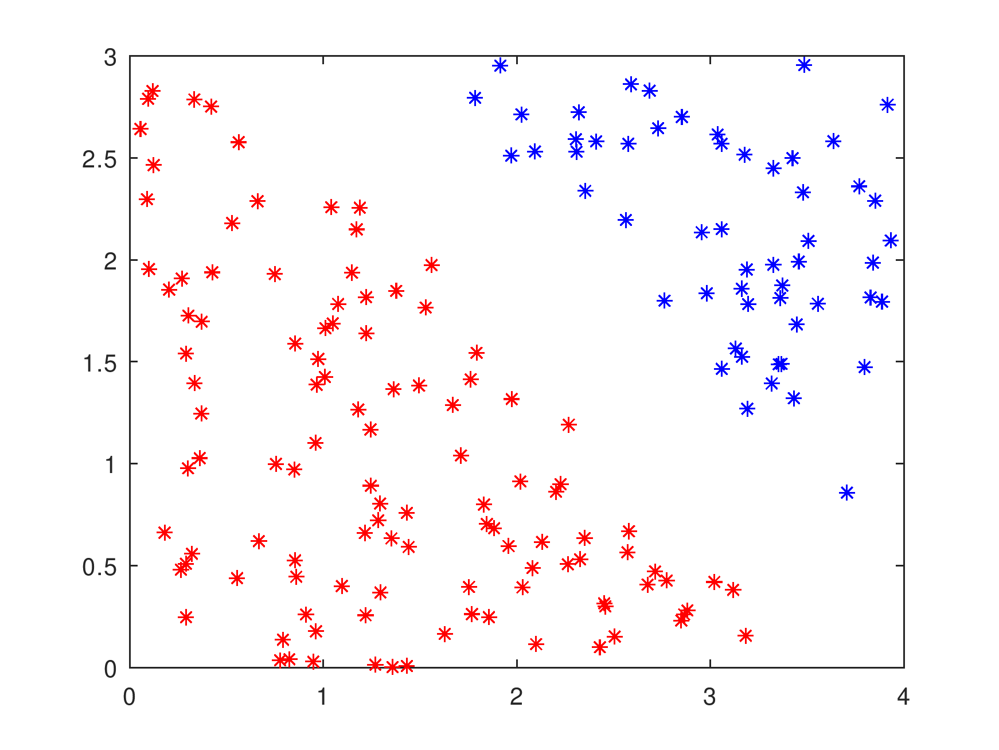
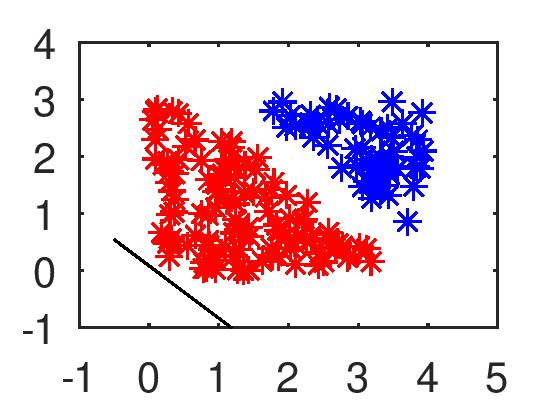
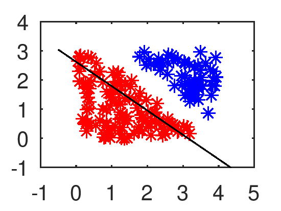
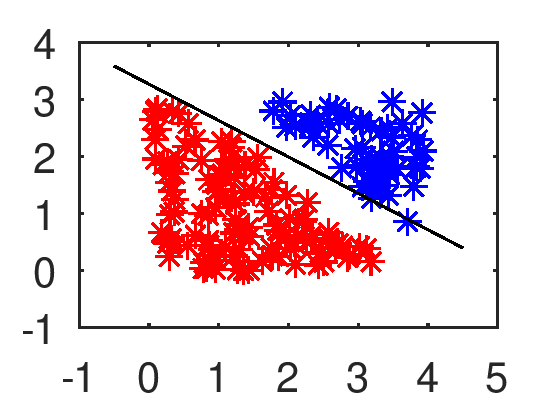
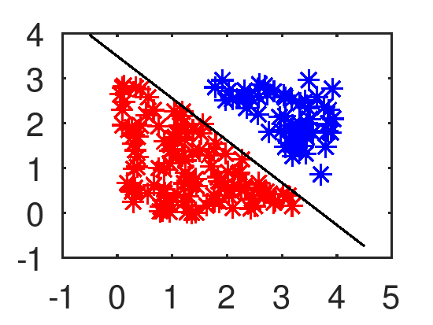

# Αλγόριθμοι Perceptrons

Στο πρώτο εργαστήριο, υλοποιήθηκε ένα νευρώνιο McCulloch-Pitts που εκπαιδεύτηκε με τον αλγόριθμο perceptron, το οποίο χρησιμοποιήθηκε σε εφαρμογές ταξινόμησης δεδομένων σε δύο διαφορετικές περιπτώσεις.

1. Στην περίπτωση που τα δεδομένα είναι γραμμικά διαχωρισμένα
2. Στην περίπτωση που το πρόβλημα επιβάλει την χρήση XOR.

Ο κώδικας υλοποιήθηκε με το εργαλείο της Matlab στο εργαστήριο.

## Περίπτωση γραμμικά διαχωρισμένων δεδομένων

### Δημιουργία γραμμικών δεδομένων

Τα δεδομένα είναι της μορφής $ <x_i, d_i> $ για $ i = 1, 2, ..., N $, όπου $ x_i $ είναι το πρότυπο εισόδου (input pattern) και $ d_i $ είναι η επιθυμητή έξοδος που δηλώνει η κάθε κατηγόρια που ανήκει το $ x_i $. Για λόγους εμπέδωσης θεωρείται ότι:

* Το $ x_i $ είναι ένα διάνυσμα που αποτελείται από δύο στοιχεία, το $ x_i1 $ και το $ x_i2 $.
* To $ d_i $ είναι $ 1 $ για τα δεδομένα της μίας κατηγορίας και $ -1 $ για τα δεδομένα της άλλης.

```matlab
N = 200; % Έστω 200 δεδομένα
x1 = 4 * rand(1, N);
x2 = 3 * rand(1, N);
data = [x1; x2];

D = x1/4 + x2/4 - 1;

tol = 0.1; % Καθορίζει το πλάτος του κενού μεταξύ των κλάσεων
idx1 = find(D > tol);
idx2 = find(D < -tol);
data1 = data(:, idx1);
data2 = data(:, idx2);

plot(data1(1, :), data1(2, :), 'b*', data2(1, :), data2(2, :), 'r*')

% Υπολογισμός επιθυμητών αποτελεσμάτων
dout1 = ones(1, size(data1, 2));
dout2 = -ones(1, size(data2, 2));

% Διαχωρισμός των κλάσεων
P = [data1 data2];
T = [dout1 dout2];

% Ανακάτεμα των δεδομένων με τυχαία μετάθεση
idx = randperm(size(P, 2));

% Πίνακας με τα δεδομένα εισόδου
P = P(:, idx);

% Διάνυσμα με τις αντίστοιχες επιθυμητές εξόδου
T = T(idx);
```



### Δημιουργία και αρχικοποίηση του perceptron

Η δημιουργία του perceptron και η αρχικοποίηση των βαρών και της πόλωσης γίνεται σε μικρούς τυχαίους αριθμούς που ανήκουν στο διάστημα $ [-0.5, 0.5] $. Το επιθυμητό τελικό αποτέλεσμα του perceptron πρέπει να είναι:

$$
\begin{align}
  y = sign(w1 * x1 + w2 * x2 + w0)
\end{align}
$$

όπου η συνάρτηση πρόσημου υλοποιεί την διπολική βηματική συνάρτηση.

```matlab
w1 = rand - .5;
w2 = rand - .5;
w0 = rand - .5;
```

### Εμφάνιση δεδομένων και αρχικού γραμμικού ορίου των 2 κλάσεων

H εξίσωση $ w1 * x1 + w2 * x2 + w0 = 0 $ καθορίζει το όριο των κατηγοριών την οποία μπορεί να εμφανίσει λύνοντας ως προς $ x2 $:

$$
\begin{align}
  -\frac{w1}{w2} * x1 - \frac{w0}{w2}
\end{align}
$$

```matlab
a = -w1 / w2;
b = -w0 / w2;

x1 = [-.5 4.5];
x2 = a * x1 + b;

plot(data1(1, :), data1(2, :), 'b*', data2(1, :), data2(2, :), 'r*')
hold on
plot(x1, x2, 'k')
axis([-1 5 -1 4])
hold off
```


### Εκπαίδευση νευρωνίου

Αρχικά πρέπει να γίνει καθορισμός του ρυθμού εκμάθησης $ ε $ και των μέγιστων εποχών. Η ίδια η εκπαίδευση του perceptron πραγματοποιείται με επαναληπτική παρουσίαση. Για το πρότυπο εισόδου $ x_j $ και επιθυμητή έξοδο $ d_j $ ο κανόνας προσαρμογής είναι:

$$
\begin{align}
w_k(new) &= w_k(old) - ε(y_j - d_j) * x_j1 \\
w_0(new) &= w_0(old) - ε(y_j - d_j)
\end{align}
$$

Όπου: $ k = 1, 2 $

Ο έλεγχος της προόδου της εκπαιδευτικής διαδικασίας μετά από κάθε εποχή υπολογίζεται με τον αλγόριθμο mean square error:

$$
\begin{align}
perc\_error = \frac{1}{N} * Σ_j(y_j - d_j)^2
\end{align}
$$

```matlab
function er = mean_squared_error(x)
  if size(x, 1) == 1
    er = x * x' / size(x, 2);
  else
    er = x' * x / size(x, 1);
  end
end
```

Οπότε:

```matlab
e = .05; % Ρυθμός εκμάθησης
maxepochs = 100; % Μέγιστες εποχές
epochlength = length(T);

changed = false;
i = 1;
W = rand(3, 1) - 0,5;

while i <= maxepochs && ~changed % Συνεχίζει μέχρι να βρει αλλάξει ή εξαντληθούν οι εποχές
  changed = true;
  for j = 1 : epochlength
    y(j) = sign(W' * [P(:, j); 1]);

    if y(j) ~= T(j) % Εάν η τωρινή εποχή είναι διαφορετική, τότε δεν άλλαξε
      changed = false;
      W = W + e * [T(j) * P(:, j); T(j)];
    end
  end

  a = -W(1) / W(2);
  b = -W(3) / W(2);
  x1 = [-.5 4.5];
  x2 = a * x1 + b;
  plot(data1(1, :), data1(2, :), 'b*', data2(1, :), data2(2, :), 'r*')
  hold on
  plot(x1, x2, 'k')
  axis([-1 5 -1 4])
  print(hf, '-dpng', '-r300', ['linear_perceptron_', int2str(i), '.png']);
  hold off
  W
  MSE = mean_squared_error(y - T)
  disp('Πατήστε ένα κουμπί για να συνεχίσει...')
  pause
  i = i + 1;
end

if changed
  disp(['Το συνολικό πλήθος επαναλήψεων είναι: ', int2str(i)])
else
  disp('Το συνολικό πλήθος επαναλήψεων δεν ήταν αρκετό.')
end

disp('Τελείωσε η εκπαίδευση του perceptron.')
```

#### Ενδεικτικό τρέξιμο

* Συνολικό πλήθος επαναλήψεων: 4

| Εποχή | Βάρη | Αποτέλεσμα του MeanShift | Διάγραμμα |
|--|--|--|--|
| Αρχικό | $ [0.2171, 0.8081, 0.2207] $ | |
| 1 | $ [0.078521, 0.109991, -0.629334] $ | $ 1.0933 $ | 
| 2 | $ [0.1922, 0.1729, -0.7293] $ | $ 0.3200 $ | 
| 3 | $ [0.1922, 0.1729, -0.7293] $ | $ 0 $ | 

### Ελάττωση του ρυθμού εκμάθησης από εποχή σε εποχή

Θα γίνει τροποποίηση του αλγορίθμου ώστε να ελαττώνει τον ρυθμό εκμάθησης από εποχή σε εποχή.

```matlab
while i <= maxepochs && ~changed
  e = 1 / i;
  changed = true;
  for j = 1 : epochlength
    y(j) = sign(W' * [P(:, j); 1]);

    if y(j) ~= T(j)
      changed = false;
      W = W + e * [T(j) * P(:, j); T(j)];
    end
  end

  a = -W(1) / W(2);
  b = -W(3) / W(2);
  x1 = [-.5 4.5];
  x2 = a * x1 + b;
  plot(data1(1, :), data1(2, :), 'b*', data2(1, :), data2(2, :), 'r*')
  hold on
  plot(x1, x2, 'k')
  axis([-1 5 -1 4])
  print(hf, '-dpng', '-r300', ['linear_perceptron_', int2str(i), '_ver2.png']);
  hold off
  W
  MSE = mean_squared_error(y - T)
  disp('Πατήστε ένα κουμπί για να συνεχίσει...')
  pause
  i = i + 1;
end
```

#### Αποτελέσματα αλλαγής ρυθμού εκμάθησης και παρατηρήσεις

* Αρχικά δεδομένα:


* Αρχικό γραμμικό όριο:


* Συνολικό πλήθος επαναλήψεων: 5

| Εποχή | Βάρη | Αποτέλεσμα του MeanShift | Διάγραμμα |
|--|--|--|--|
| Αρχικό | $ [0.9257, 0.5096, 0.2029] $ | |
| 1 | $ [2.1649, 2.5951, -6.7971] $ | $ 0.5988 $ | 
| 2 | $ [1.5219, 2.3885, -7.7971] $ | $ 0.1916 $ | 
| 3 | $ [2.0993, 2.2354, -7.7971] $ | $ 0.047904 $ | 
| 4 | $ [2.0993, 2.2354, -7.7971] $ | $ 0 $ | 

Το τελικό αποτέλεσμα είναι λιγότερο ακριβές, αλλά αρκετά πιο γρήγορο σε όλες τις περιπτώσεις που χρησιμοποιήθηκαν και οι δύο τρόποι.
